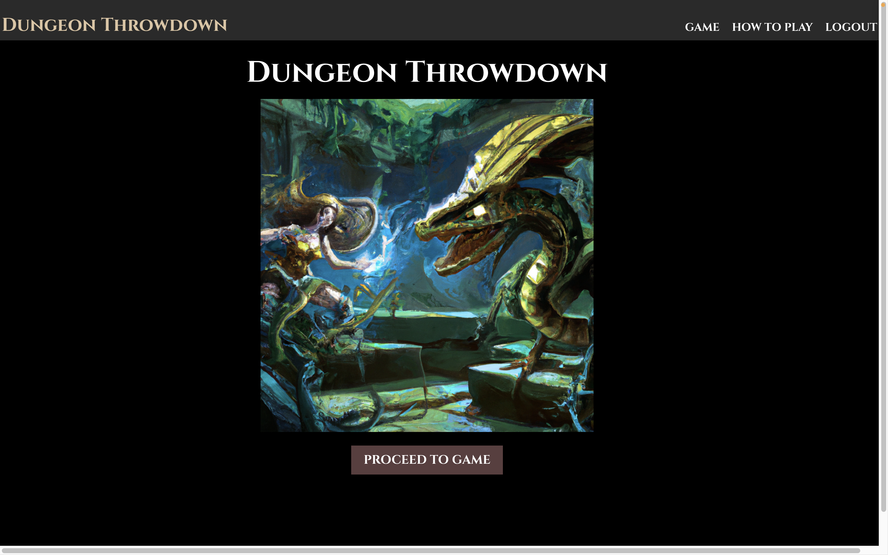
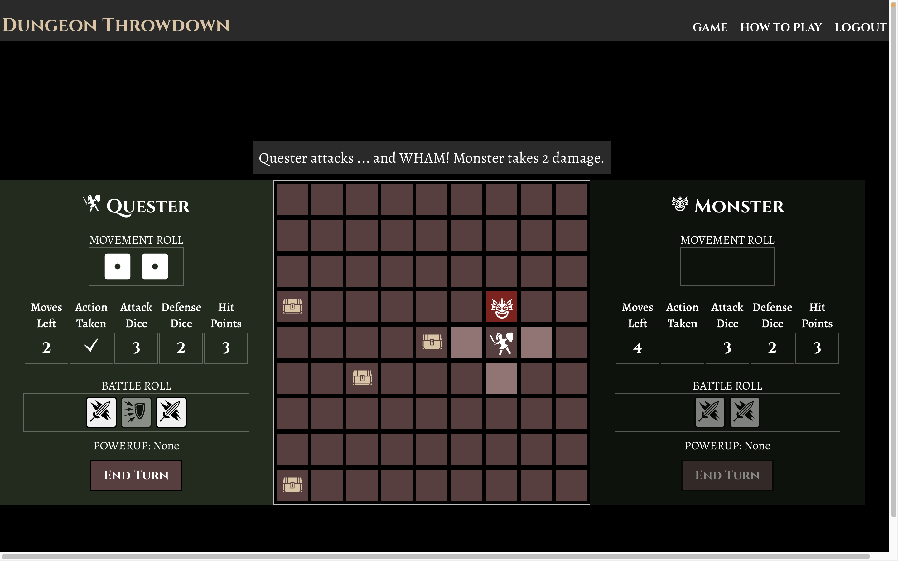

# Dungeon Throwdown

#### Play the game here! [https://dungeon-throwdown.onrender.com](https://dungeon-throwdown.onrender.com/)

For my SEI Capstone project, I've laid the foundation of a "boardgame" that I've had in mind since I first started learning to code. This version of the game is called Dungeon Throwdown, and it is a 1v1 turn-based RPG-style fighting game. It is played on a 2D grid which the players can move around, attack their opponent, and gain items and powerups.

As my requisite "new tech" for the project, I'm utilizing a library called [boardgame.io](https://boardgame.io/). This library is designed to make it easy to create multiplayer boardgames using React (of vanilla JS). It handles the game logic and state management, and has many other features that I've started to implement. The library is also a work in progress (particularly with the ability to create AI bots for single player games), which is why for now I've pivoted from my ultimate goal of a "dungeon crawler" to a 1v1 fighting game.

## Screenshots

##### Home Screen

##### Game Board

## How to Play

#### YOUR TURN

Each turn has two phases, a Movement and an Action. To
move to an adjacent tile
<em>(i.e. one above, below, or to the side of you)</em>, you can
<GiArrowCursor /> click on that tile OR press the cooresponding arrow
(or
<code>
<b>WASD</b>
</code>) key. The max number of tiles you can move each turn is determined by
your Movement Roll. You can also choose to do ONE action each turn, like
Attacking or Opening a Box.

You can choose to move or act in either order, but you can't split
up your movement around taking an action. Turns will end
automatically if you've fully moved and acted, but you can choose to
end at any time with the "End Turn" button (or pressing
<code>
<b>T</b>
</code>
).

#### COMBAT

To attack your opponent, move to an adjacent tile and
click on their tile. Each of you then rolls Battle Dice, equal to your
current number of Attack / Defense Dice. Each Sword that you roll is a success for you, and each Shield
that they roll is a success for them. If your successes exceed theirs,
they take damage and lose that many Hit Points. If the opponent's Hit
Points reach zero, you win!

#### BOXES

Items and powerups can be found in boxes
that appear around the board. Move to an adjacent square and click on a
box to open it. If the box isn't empty (!), you'll either get a one-time
use item or a powerup. A powerup will boost your Attack or Defense, but
will be lost as soon as you take damage. You can only have one powerup
at a time, so open boxes strategically!

## Technologies

- React / JSX
- Node / Express
- MongoDB / Mongoose
- boardgame.io
- React Icons

## Future Features

- Using boardgame.io's integrated Socket.io functionality to allow for networked multiplayer mode
- Persisting game state
- Saved games associated with user accounts
- Ability to move by single click to destination tile (rather than moving one tile at a time)
- Character customization
- More boards with obstacles and different layouts
- AI-powered enemies for "dungeon crawling" mode
